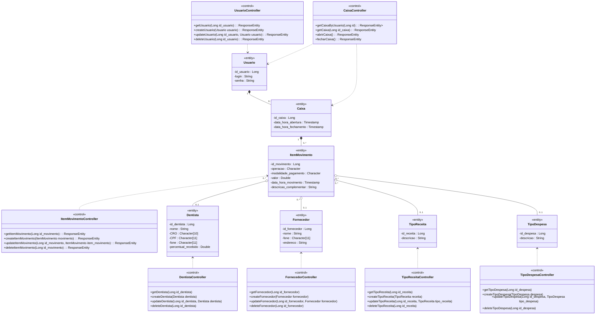
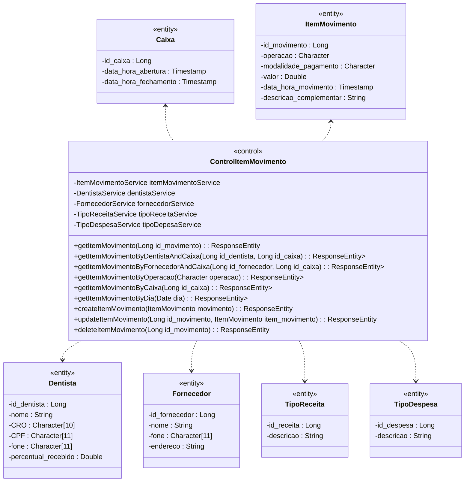
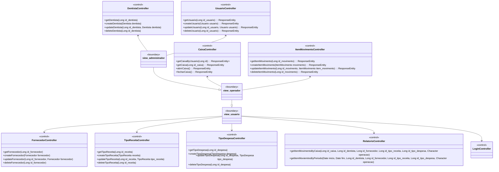

# Diagramas de Classes

## Diagrama I - Relações entidade-entidade entidade-controle

## Diagrama II - Relações ControlItemMovimento-entidades

## Diagrama III - Relações boundary-control

## Diagrama IV - Relações control-service-repository / service-service

```mermaid
classDiagram
    %% Controllers
    
    class UsuarioController {
        <<control>>
        +getUsuario(Long id_usuario) : ResponseEntity<Usuario>
        +createUsuario(Usuario usuario) : ResponseEntity<Void>
        +updateUsuario(Long id_usuario, Usuario usuario) : ResponseEntity<Void>
        +deleteUsuario(Long id_usuario) : ResponseEntity<Void>
    }

    class CaixaController {
        <<control>>
        +getCaixaByUsuario(Long id) : ResponseEntity<List<Caixa>>
        +getCaixa(Long id_caixa) : ResponseEntity<Caixa>
        +abrirCaixa() : ResponseEntity<Void> 
        +fecharCaixa() : ResponseEntity<Void>
    }

    class ItemMovimentoController {
        <<control>>
        +getItemMovimento(Long id_movimento) : ResponseEntity<ItemMovimento>
        +createItemMovimento(ItemMovimento movimento) : ResponseEntity<Void>
        +updateItemMovimento(Long id_movimento, ItemMovimento item_movimento) : ResponseEntity<Void>
        +deleteItemMovimento(Long id_movimento) : ResponseEntity<Void>
    }

    class DentistaController {
        <<control>>
        +getDentista(Long id_dentista)
        +createDentista(Dentista dentista)
        +updateDentista(Long id_dentista, Dentista dentista)
        +deleteDentista(Long id_dentista)
    }

    class FornecedorController {
        <<control>>
        +getFornecedor(Long id_fornecedor)
        +createFornecedor(Fornecedor fornecedor)
        +updateFornecedor(Long id_fornecedor, Fornecedor fornecedor)
        +deleteFornecedor(Long id_fornecedor)
    }

    class TipoReceitaController {
        <<control>>
        +getTipoReceita(Long id_receita)
        +createTipoReceita(TipoReceita receita)
        +updateTipoReceita(Long id_receita, TipoReceita tipo_receita)
        +deleteTipoReceita(Long id_receita)
    }

    class TipoDespesaController {
        <<control>>
        +getTipoDespesa(Long id_despesa)
        +createTipoDespesa(TipoDespesa despesa)
        +updateTipoDespesa(Long id_despesa, TipoDespesa tipo_despesa)
        +deleteTipoDespesa(Long id_despesa)
    }

    class RelatorioController{
        <<control>>
        +getItemMovimentoByCaixa(Long id_caixa, Long id_dentista, Long id_fornecedor, Long id_tipo_receita, Long id_tipo_despesa, Character operacao)
        +getItemMoviemtnoByPeriodo(Date inicio, Date fim, Long id_dentista, Long id_fornecedor, Long id_tipo_receita, Long id_tipo_despesa, Character operacao)
    }

    class LoginController{
        <<control>>
    }

    %% Services

    class UsuarioService {
        <<service>>
        +findById(Long id_usuario) : Usuario
        +createUsuario(Usuario usuario) : Void
        +updateUsuario(Long id_usuario, Usuario usuario) : Void
        +deleteUsuario(Long id_usuario) : Void
    }

    class CaixaService {
        <<service>>
        +findById(Long id_caixa) : Caixa
        +createCaixa(Caixa caixa) : Void 
        +updateCaixa(Caixa caixa) : Void
    }

    class ItemMovimentoService {
        <<service>>
        +findById(Long id_movimento) : ItemMovimento
        +findByCaixa_Id(Long id_caixa) : List<ItemMovimento>
        +findByDentista_IdAndCaixa_Id(Long id_dentista, Long id_caixa) : List<ItemMovimento>
        +findByFornecedor_IdAndCaixa_Id(Long id_fornecedor, Long id_caixa) : List<ItemMovimento>
        +findByTipoReceita_IdAndCaixa_Id(Long id_tipo_receita,Long id_caixa) : List<ItemMovimento>
        +findByTipoDespesa_IdAndCaixa_Id(Long id_tipo_despesa, Long id_caixa) : List<ItemMovimento>
        +findByOperacaoAndCaixa_Id(Character operacao, Long id_caixa) : List<ItemMovimento>
        +findByDataBetween(Date inicio, Date fim) : ItemMovimento
        +findByDentista_IdAndDataBetween(Long id_dentista, Date inicio, Date fim) : List<ItemMovimento>
        +findByFornecedor_IdAndDataBetween(Long id_fornecedor, Long id_caixa) : List<ItemMovimento>
        +findByTipoReceita_IdAndDataBetween(Long id_tipo_receita, Date inicio, Date fim) : List<ItemMovimento>
        +findByTipoDespesa_IdAndDataBetween(Long id_tipo_despesa, Date inicio, Date fim) : List<ItemMovimento>
        +findByOperacaoAndDataBetween(Character operacao,Date inicio, Date fim) : List<ItemMovimento>
        +createItemMovimento(ItemMovimento movimento) : Void
        +updateItemMovimento(Long id_movimento, ItemMovimento item_movimento) : Void
        +deleteItemMovimento(Long id_movimento) : Void
    }

    class DentistaService {
        <<service>>
        +findById(Long id_dentista)
        +createDentista(Dentista dentista)
        +updateDentista(Long id_dentista, Dentista dentista)
        +deleteDentista(Long id_dentista)
    }

    class FornecedorService {
        <<service>>
        +findById(Long id_fornecedor)
        +createFornecedor(Fornecedor fornecedor)
        +updateFornecedor(Long id_fornecedor, Fornecedor fornecedor)
        +deleteFornecedor(Long id_fornecedor)
    }

    class TipoReceitaService {
        <<service>>
        +findById(Long id_receita)
        +createTipoReceita(TipoReceita receita)
        +updateTipoReceita(Long id_receita, TipoReceita tipo_receita)
        +deleteTipoReceita(Long id_receita)
    }

    class TipoDespesaService {
        <<service>>
        +findById(Long id_despesa)
        +createTipoDespesa(TipoDespesa despesa)
        +updateTipoDespesa(Long id_despesa, TipoDespesa tipo_despesa)
        +deleteTipoDespesa(Long id_despesa)
    }

    %% Repositories

    class UsuarioRepository {
        <<repository>>
    }

    class CaixaRepository {
        <<repository>>
    }

    class ItemMovimentoRepository {
        <<repository>>
        +findById(Long id_movimento) : Optional<ItemMovimento>
        +findByCaixa_Id(Long id_caixa) : List<ItemMovimento>
        +findByDentista_IdAndCaixa_Id(Long id_dentista, Long id_caixa) : List<ItemMovimento>
        +findByFornecedor_IdAndCaixa_Id(Long id_fornecedor, Long id_caixa) : List<ItemMovimento>
        +findByTipoReceita_IdAndCaixa_Id(Long id_tipo_receita,Long id_caixa) : List<ItemMovimento>
        +findByTipoDespesa_IdAndCaixa_Id(Long id_tipo_despesa, Long id_caixa) : List<ItemMovimento>
        +findByOperacaoAndCaixa_Id(Character operacao, Long id_caixa) : List<ItemMovimento>
        +findByDataBetween(Date inicio, Date fim) : Optional<ItemMovimento>
        +findByDentista_IdAndDataBetween(Long id_dentista, Date inicio, Date fim) : List<ItemMovimento>
        +findByFornecedor_IdAndDataBetween(Long id_fornecedor, Long id_caixa) : List<ItemMovimento>
        +findByTipoReceita_IdAndDataBetween(Long id_tipo_receita, Date inicio, Date fim) : List<ItemMovimento>
        +findByTipoDespesa_IdAndDataBetween(Long id_tipo_despesa, Date inicio, Date fim) : List<ItemMovimento>
        +findByOperacaoAndDataBetween(Character operacao,Date inicio, Date fim) : List<ItemMovimento>
    }

    class DentistaRepository {
        <<repository>>
    }

    class FornecedorRepository {
        <<repository>>
    }

    class TipoReceitaRepository {
        <<repository>>
    }

    class TipoDespesaRepository {
        <<repository>>
    }

    %% control -> service / service -> boundary

    UsuarioController --> UsuarioService
    UsuarioService --> UsuarioRepository

    CaixaController --> CaixaService
    CaixaService --> CaixaRepository

    ItemMovimentoController --> ItemMovimentoService
    ItemMovimentoService --> ItemMovimentoRepository

    DentistaController --> DentistaService
    DentistaService --> DentistaRepository

    FornecedorController --> FornecedorService
    FornecedorService --> FornecedorRepository

    TipoReceitaController --> TipoReceitaService
    TipoReceitaService --> TipoReceitaRepository

    TipoDespesaController --> TipoDespesaService
    TipoDespesaService --> TipoDespesaRepository

    LoginController --> UsuarioService

    RelatorioController --> ItemMovimentoService

    %% service -> service

    CaixaService ..> UsuarioService

    ItemMovimentoService ..> CaixaService
    ItemMovimentoService ..> DentistaService
    ItemMovimentoService ..> FornecedorService
    ItemMovimentoService ..> TipoReceitaService
    ItemMovimentoService ..> TipoDespesaService
    
```

