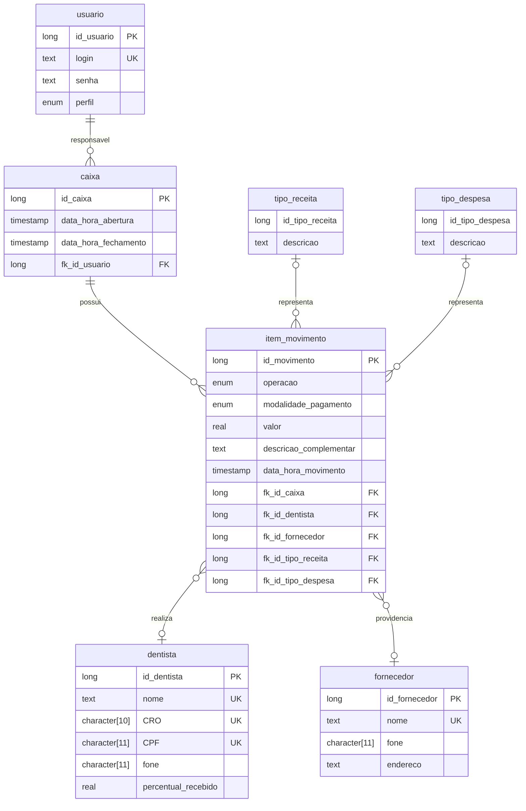

# Diagrama Entidade Relacionamento

```mermaid
erDiagram
    
    %% Relacionamentos
    
    usuario ||--o{ caixa : responsavel
    caixa ||--o{ item_movimento : possui
    item_movimento }o--o| dentista : realiza
    item_movimento }o--o| fornecedor : providencia
    tipo_receita |o--o{ item_movimento : representa
    tipo_despesa |o--o{ item_movimento : representa

    %% Atributos

    usuario {
        long id_usuario PK
        text login UK
        text senha 
        enum perfil
    }

    caixa {
        long id_caixa PK
        timestamp data_hora_abertura
        timestamp data_hora_fechamento
        long fk_id_usuario FK
    }

    item_movimento {
        long id_movimento PK
        enum operacao
        enum modalidade_pagamento
        real valor
        text descricao_complementar
        timestamp data_hora_movimento
        long fk_id_caixa FK
        long fk_id_dentista FK
        long fk_id_fornecedor FK
        long fk_id_tipo_receita FK
        long fk_id_tipo_despesa FK
    }

    dentista {
        long id_dentista PK
        text nome UK
        character[10] CRO UK
        character[11] CPF UK
        character[11] fone
        real percentual_recebido
    }

    fornecedor {
        long id_fornecedor PK
        text nome UK
        character[11] fone
        text endereco
    }

    tipo_receita {
        long id_tipo_receita
        text descricao
    }

    tipo_despesa {
        long id_tipo_despesa
        text descricao
    }
```
