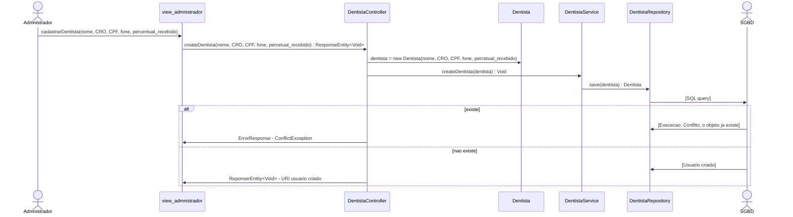

# Diagramas de Sequência

[voltar](../../../README.md)

## Diagrama - Cadastrar Dentista

```mermaid
sequenceDiagram
    actor A as Admnistrador
    participant VA as view_admnistrador
    participant DC as DentistaController
    participant D as Dentista
    participant DS as DentistaService
    participant DR as DentistaRepository
    actor S as SGBD

    A ->> VA : cadastrarDentista(nome, CRO, CPF, fone, percentual_recebido)
    VA ->> DC : createDentista(nome, CRO, CPF, fone, percetual_recebido) : ResponseEntity<Void>
    DC ->> D : dentista = new Dentista(nome, CRO, CPF, fone, percetual_recebido)
    DC ->> DS : createDentista(dentista) : Void
    DS ->> DR : save(dentista) : Dentista
    DR ->> S : [SQL query]

    alt existe
        S ->> DR : [Exececao: Conflito, o objeto ja existe]
        DC ->> VA : ErrorResponse - ConflictException
    else nao existe
        S ->> DR : [Usuario criado]
        DC ->> VA : ReponserEntity<Void> - URI usuario criado 
    end
```
